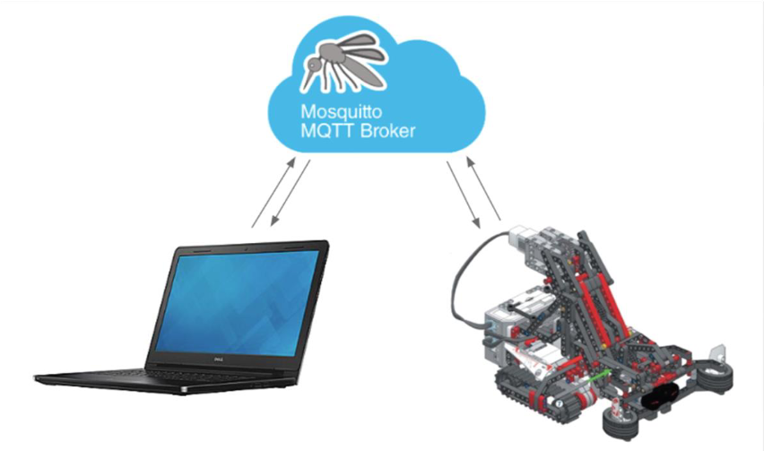

# Introduction to Programming (CSSE120)
Repository for intro to programming projects (Fall 2017)

## Projects
- Tkinter and basic Python
- MQTT control of Rasperry pi robot (see [video](https://www.youtube.com/watch?v=EWk-NJnEr0Q))

**Fig 1.** Control of Raspberry pi robot with the MQTT framework.
